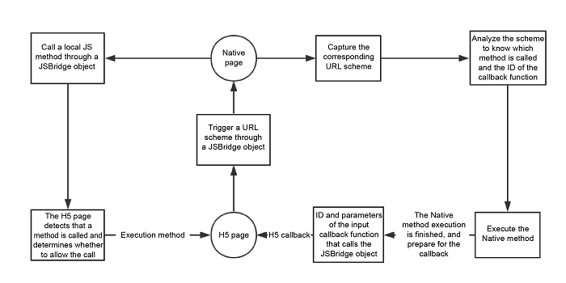
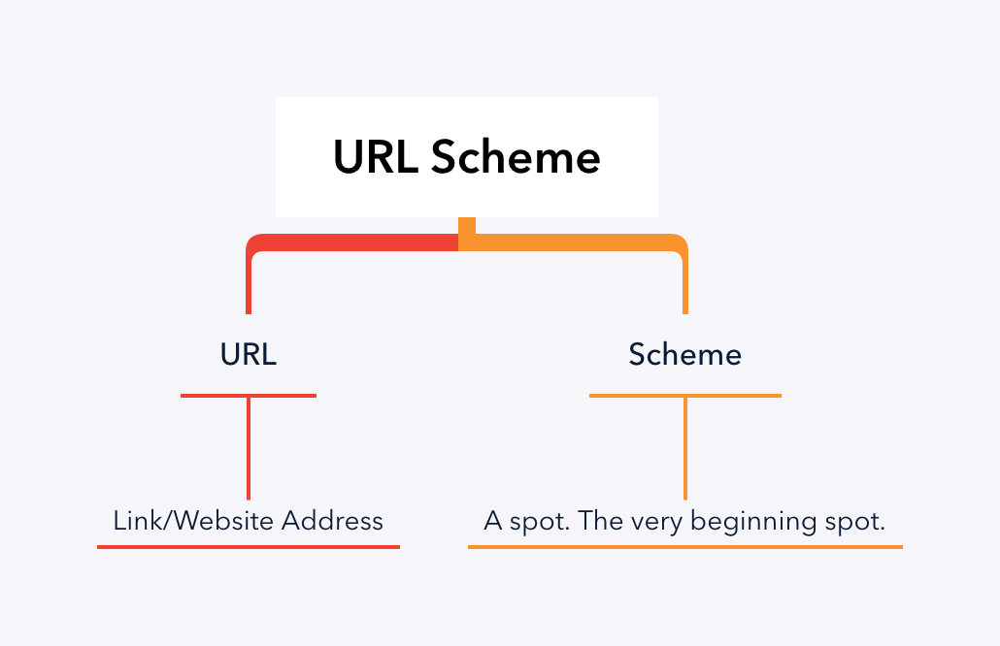

# JSBridge

`JSBridge` serves as a bridge between `JS` and `Native`. In fact, JSBridge, also known as the Hybrid app technology, is a communication method between JS and Native. In JSBridge, Native calls JS only through a fixed bridge object, and vice versa.


### SBridge Implementation Process
The process of JSBridge implementation can be summarized as follows. An H5 page triggers a URL in some way and Native captures the URL for analysis. Native then performs the processing and calls the H5 JSBridge object for transfer and callback.

#### ❗️ Since the native WebView/UIWebView controls have already achieved data communication with JS, why do we still need JSBridge?

❉ Before Android 4.4, Native calls JS method through loadUrl. In this approach, only a JS method is executed, but the returned value of this method cannot be obtained. </br>

❉ For Android 4.4 and newer versions, the JS methods are called asynchronously through evaluateJavascript and the returned value is available in onReceiveValue </br>

❉ Before API17, addJavascriptInterface has a potential security risk. Hackers can get the Native-registered JS object by decompiling and obtaining sensitive information, and then launching attacks by reflecting Java's built-in static classes on the page.</br>

❉ The URL scheme interaction is a set of existing mature solutions that are perfectly compatible with various versions and with the technology of older versions.</br>

### URL Scheme
A URL scheme is a mechanism used to define how URLs are interpreted and handled by different applications and systems. In the context of mobile and web development, URL schemes allow applications to communicate with each other, invoke specific functionality, or pass data between applications. This is particularly useful in hybrid mobile applications where web content (HTML5) needs to interact with native code (iOS or Android).



#### Example of a URL Scheme

For instance, the URL `jsbridge://openCamera?quality=high` can be broken down as follows:

✤ Scheme: jsbridge (custom scheme used to trigger native functionality)</br>
✤ Host: openCamera (the action or method to be called)</br>
✤ Query Parameters: quality=high (parameters passed to the action)</br>

#### How URL Schemes Work
1. Registration: The native application registers the custom URL scheme it wants to handle. This is done in the app’s configuration files (e.g., Info.plist for iOS, AndroidManifest.xml for Android).

2. Triggering: The web content or another application triggers the URL scheme by navigating to the URL (e.g., setting the src attribute of an iframe to the URL).

3. Interception: The native application intercepts the URL scheme. It parses the URL to extract the action and any parameters.

4. Handling: Based on the action and parameters, the native application executes the corresponding functionality.

Registering a Custom URL Scheme:
#### Android (AndroidManifest.xml)

```kotlin
<activity>
  <intent-filter>
    <action android:name="android.intent.action.VIEW" />
    <category android:name="android.intent.category.DEFAULT" />
    <category android:name="android.intent.category.BROWSABLE" />
    <data android:scheme="myapp" />
  </intent-filter>
</activity>
```

Triggering the URL Scheme:
#### JavaScript (H5 Page)
```javascript
function openCamera() {
  const iframe = document.createElement('iframe');
  iframe.style.display = 'none';
  iframe.src = 'myapp://openCamera?quality=high';
  document.body.appendChild(iframe);
  setTimeout(() => document.body.removeChild(iframe), 1000);
}

document.getElementById('openCameraButton').addEventListener('click', openCamera);
```

Handling the URL Scheme:
#### Android (Kotlin)
```kotlin
override fun onNewIntent(intent: Intent) {
  super.onNewIntent(intent)
  val uri: Uri? = intent.data
  if (uri != null && uri.scheme == "myapp") {
    handleCustomURLScheme(uri)
  }
}

private fun handleCustomURLScheme(uri: Uri) {
  val action = uri.host // "openCamera"
  val queryParams = uri.queryParameterNames
  // Execute corresponding action
}
```

#### ❗️ Why Use an iframe in JSBridge?

1. Cross-Domain Communication:
 - The same-origin policy restricts how documents or scripts loaded from one origin can interact with resources from another origin. An iframe can be used to navigate or load a special URL (URL scheme) that the native code can intercept and handle.

2. Triggering Native Code:
 - By changing the src attribute of an iframe to a custom URL scheme, the web code can send messages to the native code. The native application listens for these URL scheme changes and acts accordingly.

### JSBridge: Technical Implementation
To implement JSBridge, we need to analyze the following steps:
- Step 1: Design a global bridge object for Native to interact with JS
- Step 2: How JS calls Native
- Step 3: How Native knows that the API is called
- Step 4: URL-parameter and callback format
- Step 5: How Native calls JS
- Step 6: Registration and format of the API method in H5


### Designing Global Bridge Objects for Interaction Between Native and JS
We stipulate that the communication between JS and Native must be implemented through an H5 global object — JSBridge. The object has the following characteristics:

The object name is “JSBridge”, which is an attribute of the global object window in the H5 page. It is elaborated as:

```javascript
var JSBridge = window.JSBridge || (window.JSBridge = {});
```

This object has the following methods:

#### 1. registerHandler (String, Function)
- Purpose: Allows the H5 page to register a JavaScript method that the native code can call later.
- Parameters: 
  - String: The name of the method being registered.
  - Function: The JavaScript function to be executed when this method is called by the native code.
- Process:
  - The H5 page registers a local JS method using registerHandler.</br>
  - This method is then stored in the messageHandlers local variable.</br>
  - The native code can invoke this JS method through JSBridge when needed.

 ##### Example:
 ```javascript
 // H5 page code
window.JSBridge.registerHandler('showAlert', function(data) {
  alert(data.message);
});
 ```
In this example, the H5 page registers a method called showAlert that the native code can call to display an alert with a message.

#### 2. callHandler (String, JSON, Function)
- Purpose: Allows the H5 page to call a native API.
- Parameters:
  - String: The name of the native method to be called.
  - JSON: The data to be passed to the native method.
  - Function: A callback function to handle the response from the native method.
- Process:
  1. The H5 page calls a native method using callHandler.
  2. This triggers the corresponding URL scheme locally.
  3. The callback function and associated ID are stored in the responseCallbacks local variable.
  4. When the native method completes, it can use this callback to return data to the H5 page.

##### Example:
```javascript
// H5 page code
window.JSBridge.callHandler('openCamera', { quality: 'high' }, function(response) {
  console.log('Camera opened with response:', response);
});
```
In this example, the H5 page calls a native method openCamera with some data and provides a callback to handle the response.

#### 3. _handleMessageFromNative (JSON)
- Purpose: Allows the native code to call methods that were registered on the H5 page or to notify the H5 page of the result of a previously made call.
- Parameters:
  - JSON: The data sent from the native code.

- Process:
  1. The native code calls this method to interact with the H5 page.
  2. The method can either:
     - Call a registered JavaScript method on the H5 page.
     - Execute a callback method to notify the H5 page about the result of a previous native call.

##### Example:
```javascript
// Native code example (pseudo-code)
JSBridge._handleMessageFromNative({
  handlerName: 'showAlert',
  data: { message: 'Hello from native!' }
});
```
In this example, the native code calls the showAlert method registered on the H5 page with some data.

### Calling Native in JS
After we define the global bridge object, we can use its `callHandler` method to call the Native API.
##### Internal implementation process of the callHandler function
The callHandler execution includes the following internal steps:
1. Determine whether a callback function exists. If yes, a callback function ID is generated, and the ID and the corresponding callback is added to the callback function set responseCallbacks.
2. The input data and method name are spliced into a URL scheme through a specific parameter conversion method.

```javascript
//The URL scheme format
//Basically the useful information is the callbackId, handlerName and data at the end
//Native will analyze the scheme after it captures it
var uri = CUSTOM_PROTOCOL_SCHEME://API_Name:callbackId/handlerName?data
```
3. A internal hidden which has long been ready iframe is used for triggering the scheme

```javascript
//Process of creating the hidden iframe
var messagingIframe = document.createElement('iframe');
messagingIframe.style.display = 'none';
document.documentElement.appendChild(messagingIframe);
//Trigger the scheme
messagingIframe.src = uri;
```

> Note: Normally it is possible to initiate a network request through window.location.href. However, there is a very serious problem when we change the value of window.location.href several times in succession: the Native layer can only receive the last request, while ignoring all the previous ones. To avoid this problem, we need iframe to initiate network requests at the JS end.